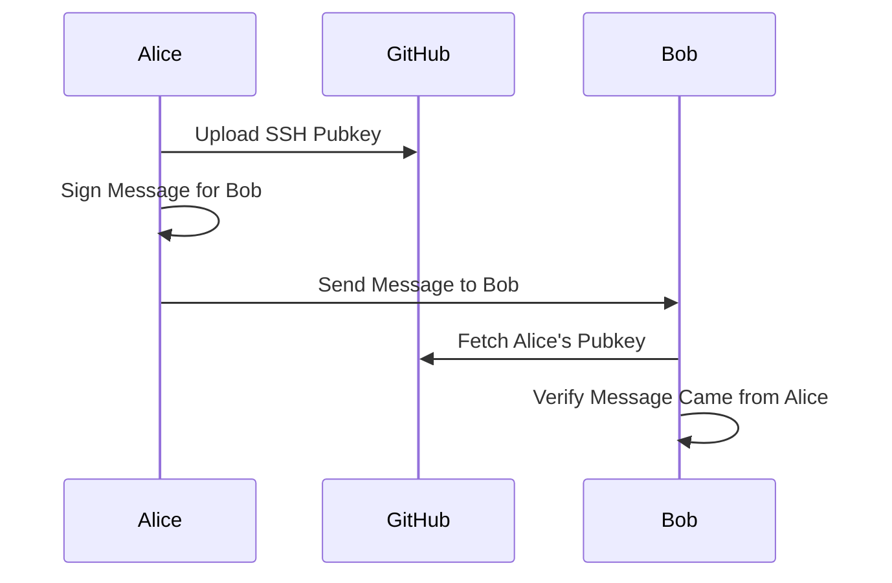

# WMAP
*Web-based Message Authentication Protocol*

This repository contains a specification and reference implementation
for a protocol which can be used for relatively secure internet
communication. Many such protocols already exist, the goal of this one
is to see what can be done with tools that software engineers are likely
to already have lying around: `git`, `ssh`, etc.

Particularly, WMAP aims to take advantage of the fact that git hosts
like GitHub, GitLab, etc tend to make users' SSH public keys available
in a [known location](https://github.com/robertdfrench.keys):

## FAQ (Fervently Anticipated Questions)
*Inspired by those of [Hubris][1]*

### Why Perl?
I don't like Perl, you don't like Perl, whatever. For ~~better or~~
worse, Perl is ubiquitous. [Git depends on Perl][2]. This means that if
you use a WMAP-compatible identity provider (a Git host), you probably
have `git` installed, and therefore you probably have a Perl interpreter
installed.

### I probably also have Python installed
Good for you. I also have Python installed. Guido van Rossum stopped by
my house and installed it manually, using a magnet and a laser to
twiddle individual bits on my filesystem, eventually forming a complete
Python installation. This is particularly impressive, because I don't
use a modern filesystem, and he arrived before I had finished running
`defrag`.

### Perl is disgusting
I have many disgusting habits, and Perl is not chief among them. 

### Why not just use GPG?
Weren't you just complaining about Perl? Also do you really want to talk
to people who [*voluntarily use GPG*][3]?

### Why not just use S/MIME?
I would love to, I really would. S/MIME could have been a contender.
Holler at me if you can help me make an S/MIME cert with my own private
key material, but signed with a certificate authority that my parents'
phones already trust. I'd toss WMAP in the WTRASHCAN for that.

### Why not just use Signal?
Signal kicks ass. I strongly recommend Signal over WMAP. Moxie even has
a blog post which spells out [why WMAP will never come close to
competing with Signal][4], and another one which details [how Signal
spins federated social protocols into Grade A Certified Anti-Static Mops
for use in their data centers][5].

<!-- # References -->
[1]: https://github.com/oxidecomputer/hubris/blob/master/FAQ.mkdn
[2]: https://github.com/git/git/search?l=Perl&q=git
[3]: https://moxie.org/2015/02/24/gpg-and-me.html
[4]: https://moxie.org/2022/01/07/web3-first-impressions.html
[5]: https://signal.org/blog/the-ecosystem-is-moving/
