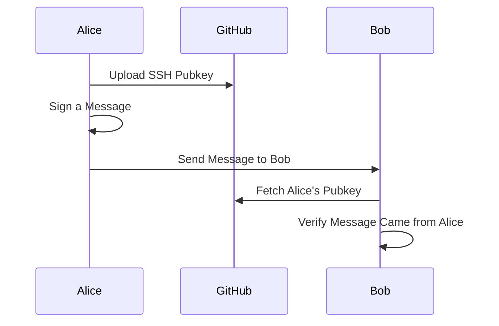
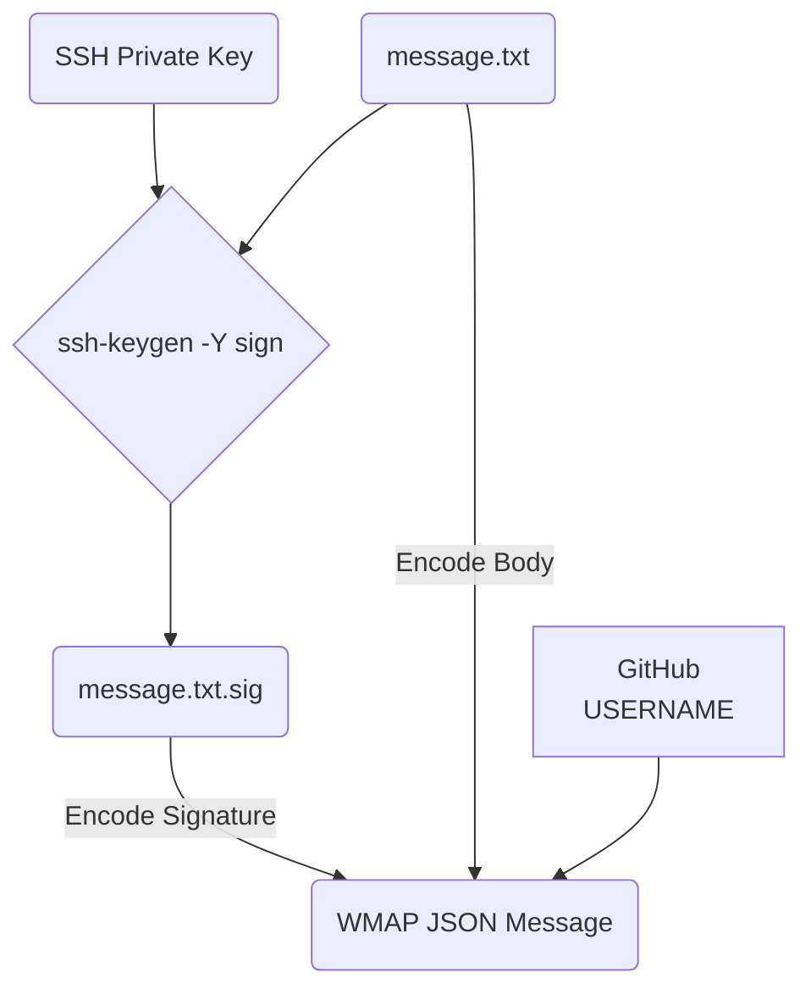
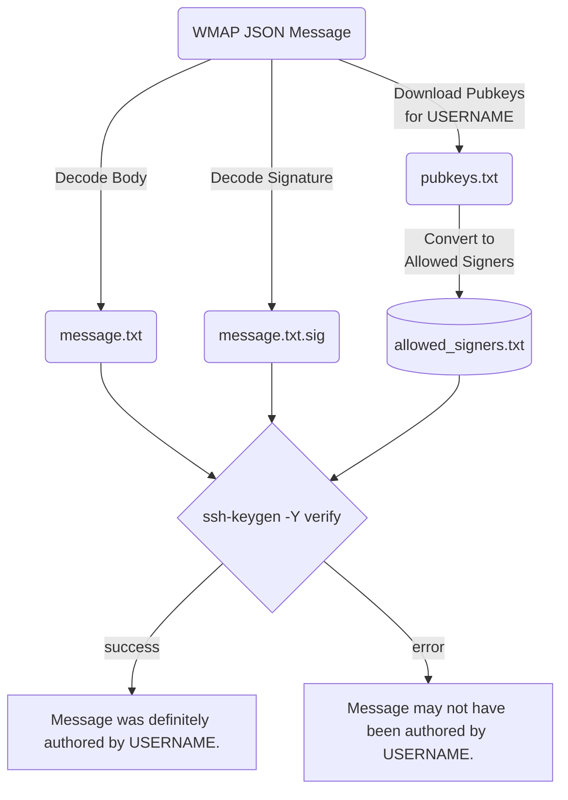

# WMAP
*The Web-based Message Authentication Protocol*

WMAP lets you validate messages against your friends' SSH pubkeys.
Since your GitHub keys are stored in a [known
location](https://github.com/robertdfrench.keys), signing documents with
these keys makes it easy for your friends to verify their integrity (and
the integrity of the documents!).

This repository contains a reference implementation for a protocol which
can be used for moderately trustworthy internet communication. Many such
protocols already exist, the goal of this one is to see what can be done
with tools that software engineers are likely to already have lying
around: `git`, `ssh`, etc.

Here's how it works at a high level:


```mermaid
sequenceDiagram
    Alice->>GitHub: Upload SSH Pubkey
    Alice->>Alice: Sign a Message
    Alice->>Bob: Send Message to Bob
    Bob->>GitHub: Fetch Alice's Pubkey
    Bob->>Bob: Verify Message Came from Alice
```

## Tutorial
First, clone this repository!

### Signing a Document
In the repo, run `./wmap sign <username> <key> <file>`. These arguments
are:
- `<username>`: Your GitHub username.
- `<key>`: Path to your SSH private key.
- `<file>`: Path to the file you want to sign.

Now you've got a signed version of `<file>` called `<file>.wmap`, which
you can send to your friends!

### Verifying a Message
To verify a signed document, you only need the `.wmap` file created in the previous step.

```bash
./wmap verify <file>.wmap
```

where `<file>.wmap` is the path to the signed WMAP file.  If the
verification is successful, the command will complete without any
output. If the verification fails, the script will exit with a non-zero
status.

### Extracting a Document from a Verified Message
If you've received a WMAP message from a friend, they probably want you
to read the message inside. To extract this message, use the `extract`
command:

```bash
./wmap extract <file>.wmap
```

This will print the body of `<file>.wmap` to stdout.

Keep in mind that this command will fail if the wmap file cannot be
verified.  If you need to extract it anyways, you can do this:

```bash
./wmap extract --skip-validation <file>.wmap
```

## Protocol Details
WMAP is a simple protocol based on SSH signatures. The command which
creates these signatures ([`ssh-keygen(1)`][1]) is intentionally
generic, and WMAP is an opinionated refinement of that. By bundling the
message data, a canonical author name, and the signature into a single
file, WMAP makes it easier to transfer and validate documents signed
with ssh keys.


### Message Structure
The central idea behind WMAP is that every GitHub user's SSH public keys
are available at `https://github.com/<username>.keys`. This means that
any message signed with one of the corresponding private keys can be
verified by anyone who knows the author's GitHub username. As such, WMAP
messages need the following three fields:

- profile: the author's GitHub username
- body: a Base64-encoded representation of the input message
- signature: a Base64-encoded representation of the author's SSH
  signature of the original input message (not the base64
  representation in the `body` field).

It will look something like this:

```json
{
    "profile": "robertdfrench",
    "body": "aGVsbG8K",
    "signature": "LS0tLS1CRUd..."
}
```

Anyone with access to github.com can retrieve the author's public keys
and verify the message signature against them. *This does mean that if a
GitHub user removes a public key, messages signed with that key will no
longer be valid.*


### Signing
Messages are signed using the `ssh-keygen(1)` command, specifically the
`-Y sign` flag. This signing operation takes an input file (the message
to be signed), a private key, and a "namespace" -- an identifier to
distinguish custom signing applications.

For an input file called `message.txt`, ssh-keygen will produce a
signature file called `message.txt.sig`. WMAP requires that base64-encoded
versions of these files be bundled into a single document (according to
the [Message Structure](#message-structure) defined above).


```mermaid
flowchart TD
    M(WMAP JSON Message)
    S(message.txt.sig)
    B(message.txt)
    U[GitHub<br/>USERNAME]
    P(SSH Private Key)
    K{ssh-keygen -Y sign}
    P --> K
    B --> K
    K --> S
    S -->|Encode Signature| M
    B -->|Encode Body| M
    U -->M
```

#### Namespaces
`ssh-keygen(1)` requires every signing operation to use a *namespace* in
order to avoid confusing signatures created for differing use cases. The
[manual entry][1] suggest using the namespace string
"NAMESPACE@YOUR.DOMAIN" for custom purposes, so WMAP messages use the
namespace string "wmap@wmap.dev".


### Authentication
By including the username and signature alongside the message, WMAP
bundles everything necessary for authentication in one place. The
authentication process works as follows:

1. The base-64 representations of the message and its signature are
   extracted and stored on disk. 
2. The author's SSH public keys, as listed on GitHub, are transformed
   into an [Allowed Signers][2] file.
3. The `ssh-keygen(1)` command (specifically the `-Y verify` subcommand)
   is used to verify the message and its signature against the Allowed
   Signers file.


```mermaid
flowchart TD
    M(WMAP JSON Message) -->|Decode Signature| S(message.txt.sig)
    M -->|Decode Body| B(message.txt)
    M -->|Download Pubkeys<br/> for USERNAME| G(pubkeys.txt)
    G -->|Convert to<br/>Allowed Signers| A[(allowed_signers.txt)]
    B -->K{ssh-keygen -Y verify}
    S -->K
    A -->K
    K -->|success| Y[Message was definitely authored by USERNAME.]
    K -->|error| N[Message may not have been authored by USERNAME.]
```

#### Allowed Signers
An [Allowed Signers][2] file is a list of named SSH Public Keys against
which a message and a signature can be authenticated. For the purposes
of WMAP, such files have the following format:

    <GitHub Username> namespaces="wmap@wmap.dev" ssh-rsa AAAAX1...
    <GitHub Username> namespaces="wmap@wmap.dev" ssh-ed25519 AAAB4...
    ...

The wmap client constructs these files on the fly before each
authentication operation, so that the latest keys are always pulled from
GitHub.

`ssh-keygen(1)` requires a file of this format in order to perform
verification with the `-Y verify` subcommand. WMAP-flavored Allowed
Signers files could be produced with something along the lines of this
shell script:

```sh
GH_USERNAME="robertdfrench"
curl --silent "https://github.com/${GH_USERNAME}.keys" \
    | sed 's/^/namespaces="wmap@wmap.dev" /' \
    | sed "s/^/${GH_USERNAME} /" \
    > allowed_signers.txt
```

<!-- REFERENCES -->
[1]: https://www.man7.org/linux/man-pages/man1/ssh-keygen.1.html
[2]: https://www.man7.org/linux/man-pages/man1/ssh-keygen.1.html#ALLOWED_SIGNERS
